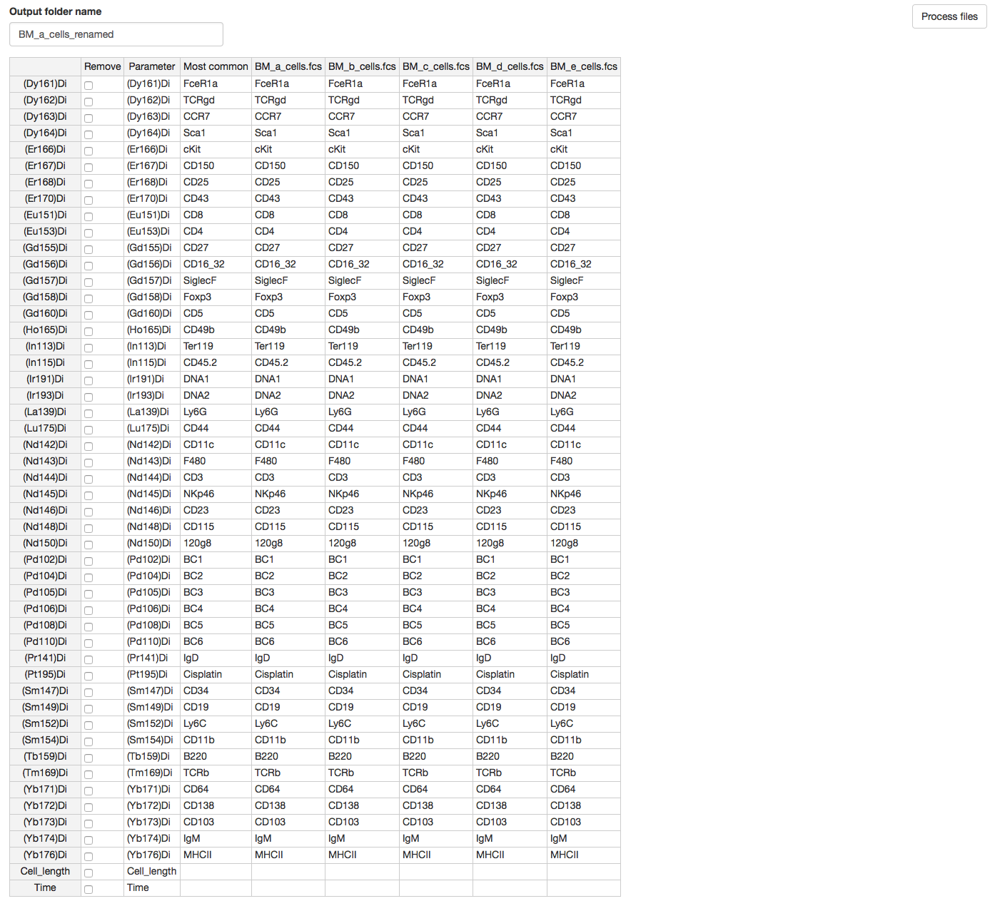
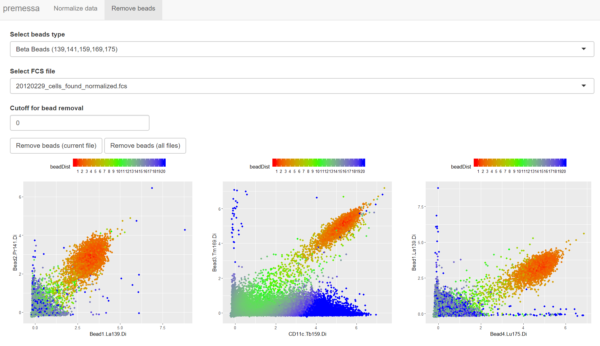

# Installing required software

The following R packages are required for this tutorial:
* [devtools](https://github.com/r-lib/devtools)
* [flowCore](http://bioconductor.org/biocLite.R)
* [premessa](https://github.com/ParkerICI/premessa)
* [vite](https://github.com/ParkerICI/vite)
* [grappolo](https://github.com/ParkerICI/grappolo)
* [panorama](https://github.com/ParkerICI/panorama)


In order to install some of these packages, you must be able to compile C++ source packages on your system:
  - Windows: Install the [Rtools](https://cran.r-project.org/bin/windows/Rtools/) package
  - MacOS:  Install the XCode software from Apple that is freely available on the App Store. Depending on the specific version of XCode you are using you might also need to install the "Command Line Tools" package separately. Please refer to the XCode Documentation
  - Linux: Install GCC. Refer to the documentation of your distribution to find the specific package name


To install the R packages, open an R session and enter the following command lines:

```R
# This installs the Bioconductor flowCore package, which is used to read FCS files
source("http://bioconductor.org/biocLite.R")
biocLite("flowCore")

# This installs the devtools package, which is required to install packages from github
install.packages("devtools")

devtools::install_github("ParkerICI/premessa")
devtools::install_github("ParkerICI/grappolo")
devtools::install_github("ParkerICI/vite")
devtools::install_github("ParkerICI/panorama")
```
# Usage notes

Several tools described in this tutorial are Graphical User Interfaces (GUIs) built using the [shiny](https://shiny.rstudio.com/) framework. It is a good idea to familiarize yourself with starting and stopping these GUI applications. In general:
* You start the application by invoking some function in your R console, e.g. `premessa::normalizer_GUI()`
* For several applications you will be requested to select a working directory, which contains all the files that are part of the analysis. To this end, immediately after you start the application, a file selection dialog will pop-up. Unfortuantely R does not provide the infrastructure to select *directories*. What you will do instead is selecting **any** *file* that's contained in the directory of intereset, and the corresponding directory will be selected
* To stop the application switch back to your R console and press the `ESC` key. Note that while the application is running, it "hijacks" you R session, therefore anything you type in there will not have any effect. The only thing you can do in your R session while the application is running is pressing `ESC` to stop it

Another general note before we start. There are two ways to invoke a function that is part of an R packages:
* By invoking it directly
```R
premsessa::normalizer_GUI()
```
* By loading the package first
```R
library(premessa)
normalizer_GUI()
```
In this tutorial we will use both formats, depending on how many functions we are calling from the same package (the second format saves a lot of typing if you are using multiple functions from the same pacakage in your analysis)

# Description of the dataset used in this tutorial

**[ADD A DECSRIPTION OF THE DATASET, HOW MANY FILES, HOW THEY ARE ORGANIZED, WHAT SAMPLES THEY REPRESENT]**

# Overview

In this tutorial, we will go step-by-step covering methods to analyze and visualize high-dimensional single cell data. Wihle these methods are applicable to both flow and mass-cytometry data, this tutorial uses a mass-cytometry [dataset](https://github.com/ParkerICI/July-2018-single-cell-workshop/tree/master/Science%20datasets) (from a 2015 [publication](https://www.ncbi.nlm.nih.gov/pmc/articles/PMC4537647/) in _Science_).

We will go through the following steps which, save for a few exceptions, would also apply to a flow-cytometry dataset:

* [Panel editing](#panel-editing) 
* [Normalization](#normalization) (Mass Cytometry)
* [De-barcoding](#de-barcoding) (Mass Cytometry)
* [Gating](#gating)
* [Visualization - running the analysis](#visualization---running-the-analysis)
  * [Unsupervised visualization](#unsupervised-visualization)
  * [Scaffold maps](#scaffold-maps)
* [Visualization - exploring the results](#visualization---exploring-the-results)
* [Associating cell populations with endpoints of interest](#associating-cell-populations-with-endpoints-of-interest)
  

# Panel editing
Most analysis tools expect files that are part of the same analysis to have parameters and reagents named consistently. The [premessa](https://github.com/ParkerICI/premessa) includes a GUI tool that can be used to rename and synchronize panels across multiple FCS files.


****(create a case from existing files where we'd have to apply this step)*****

### Starting the panel editing GUI and selecting the working directory and example data

You can start the panel editing GUI by typing the following command in your R session:
```R
premessa::paneleditor_GUI()
```
This will open a new web browser window, which is used for displaying the GUI, and a file selection dialog to select the working directory (see [Usage notes](#usage-notes))




To stop the software simply hit the "ESC" key in your R session.
_Note_: If the GUI does _not_ open a new web browser, hit the "ESC" key and re-enter the above command.


# Normalization
The sensitivity of a CyTOF machine changes between different days (due to tuning) as well as during a single run due to variations in detector performance. To correct for this problem, [this](https://www.ncbi.nlm.nih.gov/pubmed/23512433) publication introduced the use of polystirene beads that can be used as a reference synthetic standard (the beads are commercially available from [Fluidigm](https://www.fluidigm.com/))

The normalization algorithm works by identifying a reference intensity for the beads channel and then applying a correction factor to the data so that the intensity at every specific time matches the reference intensity

This reference intensity can be calculated in one of two ways:
* By calculating the median bead intensity for all the files that are part of the current analysis
* By referring to a previously acquired set of beads, derived for instance from another experiment

For the purpose of this tutorial we will use the first method. The workflow involves the following steps:
1. Bead identification through gating
2. Data normalization
3. Bead removal (optional)

Assuming you're using the example [Science data](https://github.com/ParkerICI/July-2018-single-cell-workshop/tree/master/Science%20datasets) as your working directory and it contains four FCS files called BM_cells.FCS, SPL_cells.FCS, LN_cells.FCS and BLD_cells.FCD, at the end of the workflow the following directory structure and output files will be generated:

```
Science data
|--- BM_cells.FCS 
|--- SPL_cells.FCS 
|--- LN_cells.FCS 
|--- BLD_cells.FCS
|--- normed
     |--- BM_cells_normalized.fcs
     |--- SPL_cells_normalized.fcs
     |--- LN_cells_normalized.FCS 
     |--- BLD_cells_normalized.FCS
     |--- beads_before_and_after.pdf
     |--- beads_vs_time
          |--- BM_cells.pdf
          |--- SPL_cells.pdf
          |--- LN_cells.pdf
          |--- BLD_cells.pdf
     |--- beads_removed
          |--- BM_cells_normalized_beadsremoved.fcs
          |--- SPL_cells_normalized_beadsremoved.fcs
          |--- LN_cells_normalized_beadsremoved.fcs
          |--- BLD_cells_normalized_beadsremoved.fcs
          |--- removed_events
               |--- BM_cells_normalized_removedEvents.fcs
               |--- SPL_cells_normalized_removedEvents.fcs
               |--- LN_cells_normalized_removedEvents.fcs
               |--- BLD_cells_normalized_removedEvents.fcs 
     |--- beads
          |--- BM_cells_beads.fcs
          |--- SPL_cells_beads.fcs
          |--- LN_cells_beads.fcs
          |--- BLD_cells_beads.fcs
```

- *BM_cells_normalized.fcs*: contains the normalized data, with an added parameter called *beadDist* representing the square root of the Mahalanobis distance of each event from the centroid of the beads population
- *beads_before_and_after.pdf*: a plot of the median intensities of the beads channels before and after normalization. This plot contains a single median value per sample. Therefore it will not be informative if you are normalizing a single sample
- *beads_vs_time*: this folder contains a plot for each file, displaying the intensity of the beads before and after normalization as a function of time
- *BM_cells.pdf*: a plot of the intensities of the beads channels along time, before and after normalization
- *BM_cells_normalized_beadsremoved.fcs*: the normalized data with the beads events removed
- *BM_cells_normalized_removedEevents.fcs*: the events that have been removed from the normalized data based on the Mahalanobis distance cutoff 
- *BM_cells_beads.fcs*: the beads events, as identified by gating

## Using the normalizer GUI
You can start the normalizer GUI by typing the following commands in your R session (see [usage](#usage) for general information about using the GUI):

```R
premessa::normalizer_GUI()
```

Select any file from the [Science dataset](https://github.com/ParkerICI/July-2018-single-cell-workshop/tree/master/Science%20datasets). The directory itself will then become the working directory for the software. 

The GUI contains two tabs:

**1. Normalize data:** used for beads gating and normalization 


This panel contains the following controls:

- *Select beads type*: select the type of normalization beads that have been used for the experiment. Here we will use *Beta Beads (139, 141, 159, 175)*. The numbers indicate the beads channels used for normalization.
- *Select FCS file*: the FCS  that is currently being visualized for gating. This dropdown will contain all the FCS files located in the working directory. You are going to have to gate each file individually. Only the files that you have manually gated will be normalized, as detailed in the _"You have gated beads for the following files"_ The gating plots will appear under the row of buttons.
- *Select baseline for normalization*: the baseline beads intensities to be used for normalization. You can either use the median beads intensities of the FCS files that you are currently using for normalization (*Current files* option), or the median intensities of an existing set of beads files (*Existing folder of beads files*). For the purpose of this tutorial we will use the *Current files* option. If you wanted to use the other option, a file selection dialog would pop-up when you select the option. You would then use the window to navigate to a directory containing FCS files of beads events only (for instance the *BM_a_cells_beads.fcs* file in the above example) and select one of the files. The software would then load *all* the files contained in the same directory as the file you selected. The currently selected folder will be displayed in a text box on the right. 
- *Visualize beads*: clicking this button will color in red the events that are recognized as beads events in the gating plots. Note that this is only for visual display, whether you push this button or not does not change the operation of the normalization algorithm
- *Apply current gates to all files*: applies the current gates to all the files. Use this if you are satistified with the gates and you do not want to cycle manually through all the files
- *Normalize*: starts the normalization routine. 

The workflow involves cycling through all the files (there are five of them- a through e in our example) and adjusting the beads gates in the plot, in order to identify the beads. You can cycle back and forth between different files, as the GUI will remember the gates you have selected for each file. Only events that are included in *all* the beads gates are identified as beads. As detailed in the dialog box that is above the row of buttons, only files for which the gates have been defined will be used as input for normalization. 

After you hit the *Normalize* button, the normalization routine will start. When the process is completed a confirmation dialog will appear and the normalized versions of the selected files will be  saved in the directory you selected the files from. 


**2. Remove beads**: used for beads removal 

This panel has the following controls:

- *Select beads type*: same as for the *Normalize data* panel: select the type of normalization beads that have been used for the experiment. In our example, we are using the *Beta Beads* option.
- *Select FCS file*: select the FCS file for plotting. The dropdown will contain all the FCS files located in the *normed* sub-folder of the working directory. The plots will appear below the row of buttons. See below for a description of what the plots represent
- *Cutoff for bead removal*: the Mahalanobis distance cutoff to be used for bead removal. This requires looking at the data and chosing an appropriate cut point (orange = beads, blue = not-beads, more on this below)
- *Remove beads (current file)*: use the current cutoff to remove beads from the currently selected file. When the process is completed a confirmation dialog will appear
- *Remove beads (all files)*: use the current cutoff to remove beads from all the files in the folder (i.e. all the files that are listed in the *Select FCS file* dropdown). When the process is completed a confirmation dialog will appear

 
The bead removal procedure is based on the idea of looking at the distance between each event and the centroid of the beads population, and removing all the events that are closer than a given threshold to the beads population, and therefore are likely to represent beads (or beads-cells doublets) as opposed to true cells.

To this end, during normalization, the software calculates the square root of the Mahalanobis distance of each event from the centroid of the beads population, and records this information in the *beadDist* parameter in the FCS file with the normalized data (i.e. the *_normalized.fcs* files in the *normed* sub-folder).

During the beads removal step, all the events whose *beadDist* is less or equal than the *Cutoff for bead removal* parameter are removed from the FCS. The removed events are saved in the *removed_events* sub-folder (see above).

The plots in the bottom half of the panel help you select an appropriate cutoff. They display all the pairs of beads channels. Beads should appear as a population in the upper right corner (as they will be double-positives for all the channel pairs). The color of the points represent the distance from the beads population. You should choose a cutoff so that most of the bead events (orange) are below the cutoff, and most of the non-beads events (blue) are above it. The legend for the color scale is located above the plots.



# De-barcoding

Barcoding (described in [this](https://www.ncbi.nlm.nih.gov/pubmed/25612231) publication) is a way to minimize staining variability across multiple samples. Each sample is labeled with a unique combination of metals before staining. All the samples are then pooled in a single tube, and stained in a single reaction, which guarantees that they are all exposed to the same amount of antibody.

After the data for this pooled sample is acquired, the software goes through each cell event and assigns it to one of the original samples, based on the combination of barcode labels that are measured on that cell. Each sample is written in a separate file, therefore a single FCS file from the pooled sample is processed by this software to give as many FCS files as the number of samples that were pooled.

It is important to note that barcoding only addresses variability that is due to staining differences. It does **not** account for variation due to instrument setup or sensitivity (you need to use [normalization](#normalization) for that)

Assuming the FCS file *BM_cells.fcs* is located in the directory *Science Data*, and the barcode key defines 20 barcoded populations (1-20), the following directories and output files will be created at the end of the debarcoding process:

```
Science Data
|--- BM_cells.fcs
|--- debarcoded
     |--- BM_cells.Pop01.fcs
     |--- BBM_cells.Pop02.fcs
     |--- BM_cells.Pop03.fcs
     |--- BM_cells.Pop04.fcs
     |--- BBM_cells.Pop05.fcs
     |--- BM_cells.Pop06.fcs
     |--- BM_cells.Pop07.fcs
     |--- BBM_cells.Pop08.fcs
     |--- BM_cells.Pop09.fcs
     |--- BM_cells.Pop10.fcs
     |--- BBM_cells.Pop11.fcs
     |--- BM_cells.Pop12.fcs
     |--- BM_cells.Pop13.fcs
     |--- BBM_cells.Pop14.fcs
     |--- BM_cells.Pop15.fcs
     |--- BM_cells.Pop16.fcs
     |--- BBM_cells.Pop17.fcs
     |--- BM_cells.Pop18.fcs
     |--- BM_cells.Pop19.fcs
     |--- BBM_cells.Pop20.fcs
     |--- BM_cells_Unassigned.fcs
```

## Using the de-barcoding GUI 

The de-barcoding workflow mainly consists of selecting the optimal threshold for the separation between the barcode channels. This is done by manually inspecting a number of diagnostic plots that are displayed in the GUI.

More specifically, the assignment to a specific population is performed by looking at the separation between positive and negative barcode channels for each cell. Well separated events can be confidently assigned however, as the separation decreases, cells will be discarded (i.e. left unassigned) because they cannot be reliably assigned. The idea is to identify a separation threshold that is stringent enough to correctly assign cells to their barcode population but not so stringent that a lot of cells need to be discarded. This is mainly done by inspecting the *Separation* plot (see below)

You can start the de-barcoding GUI by typing the following commands in your R session:

```R
premessa::debarcoding_GUI()
```
Upon launching the GUI you will have access to the following controls:

- *Current barcode key*: the CSV file containing the barcode key. Select the key associated with our sample dataset by pressing the *Select key* button and select the file containing the barcode key
- *Current FCS file*: the FCS that is currently being debarcoded. Here we will again continue with the bone marrow data file. Press the *Select FCS* button to select the FCS file you want to debarcode. Upon selecting both the FCS file and the key, the preliminary debarcoding process will start immediately. After a few seconds a number of diagnostic plots will appear in the right portion of the window (see [below](#plot-types))
- *Minimum separation*: the minimum seperation between the positive and negative barcode channels that an event needs to have in order to be assigned to a sample. Events where the separation is less than this threshold are left unassigned. This filtering is done after rescaling the intensity of the barcode channels, and therefore the threshold should be a number between 0 and 1. For our example we will use a minimum separation = 0.4.
- *Maximum Mahalanobis distance*: the maximum distance between a single cell event, and the centroid of the sample the event has been assigned to. Events with distance greather than the threshold are left unassigned. The distance is capped at 30, so the default value of this option does not apply a filter based on Mahalanobis distance. Note that in some cases (for instance when there are very few events in a sample), the Mahalanobis distance calculation may fail. In this case a diagnostic message is printed in the R console, and filtering based on Mahalanobis distance is not performed for the corresponding sample.
- *Plot type*: selects the type of plot to be displayed. Please see [below](#plot-types) for a description of the plots. Depending on the plot type, a few additional controls may be displayed:
  - *Select sample*: select a specific sample for plotting. Sample names are taken from the barcode key
  - *Select x axis*: select the channel to be displayed on the x axis
  - *Select y axis*: select the channel to be displayed on the y axis
- *Save files*: hitting this button will apply the current settings, performed the debarcoding, and save the resulting output files

### Plot types

There are four types of visualization that allow you to inspect the results of the debarcoding process, and choose the optimal seperation and Mahalanobis distance thresholds. Each plot window is subdivided into a top and bottom section, as described below:

- *Separation*
  - *Top*: A histogram of the separation between the positive and negative barcode channels for all the events
  - *Bottom*: Barcode yields as a function of the separation threshold. As the threshold increases, the number of cells assigned to each sample decreases, and more events are left unassigned. The currently selected threshold is displayed as a vertical red line. **This is probably the most important plot**. The ideal separation threshold is usually found right before the end of the plateau in barcode yields, before the curve drops dramatically


- *Event*
  - *Top*: Bargraph or cell yields for each sample after debarcoding, given the current settings
  - *Bottom*: Scatterplot showing the barcode channel intensities for each event, ordered on the x axis. The left plot displays the original data, arcsinh transformed. The plot on the right displays the data rescaled between 0 and 1, which is actually used for debarcoding. Both plots only displays data for the selected sample (use the *Select sample* dropdown to pick the active sample)
- *Single biaxial*
  - *Top*: Bargraph of cell yields for each sample after debarcoding, given the current settings
  - *Bottom*: Scatterplot of barcode channel intensities for the selected sample. The channels displayed on the x and y axis are selected using the dropdown menus on the left (*Select x axis*, *Select y axis*). The points are colored according to the Mahalanobis distance from the centroid of the population. The color scale is displayed on top of the graph. The values plotted are arcsinh  transformed.
- *All barcode biaxials*
  - *Top*: Bargraph of cell yields for each sample after debarcoding, given the current setting
  - *Bottom*: a matrix of scatterplots of barcode channel intensities for the selected sample. All possible combinations are displayed, and the channels represented on the rows and columns are identified by the names on the axes of the bottom and left-most plots. The plots on the diagonal display the distribution of intensity values for the corresponding channel

# Gating

Whatever analysis you are thinking of doing, some amount of gating is usually required. At a minimum you usually want to remove doublets and dead cells.

Depending on the panel you are using, you may also need to remove certain populations that you do not want to include in the analysis. For instance if you are using a T-cell specific panel, you will probably want to exclude any non T-cell from the analysis, since the panel does not include any useful measurement on those

The process of gating will not be covered in this tutorial, as there are multiple commercial packages available for this

# Clustering

Now that we have a set of pre-processed and cleaned up files, it is time to start analyzing the data.

Clustering, i.e. the process of grouping together cells that express similar combination of markers, is a very useful first step, as it reduces the amount of data to work with from potentially millions of individual cells, to a few hundred clusters.

Ideally the concept of cluster would correspond to the biological concept of population, but this may very well not happen in practice. A cellular population is defined by function (i.e. two cells belong to two separate populations if they have different functional properties). Therefore a cluster may not correspond to a population because:

1. Clustering itself is a not a well-defined computational problem, and no clustering algorithm is perfect
2. While different populations have different functions and they can be distinguished based on marker expression, this relationship is not linear: minor differences in marker expression may have large functional consequences and vice versa.

For the purpose of this analysis, we can imainge to use clustering two ways:

1. Estimating the actual number of populations in the data, i.e. as much as possible get to the point where 1 cluster = 1 biological population.
2. Using clustering exclusively as a mean to reduce the size of the data, tending to err on the side of over-clustering, i.e. setting the clustering parameters so that the algorithm will produce more clusters than there are populations in the data, with the understanding that further analysis/visualization will reveal relationships between the clusters, possibly highlighting cases where a single population has been erroneously broken up into multiple redundant clusters.

In this tutorial we will apply the second approah using the [groppolo](https://github.com/ParkerICI/grappolo]) R package.

Another important point is if and how data is pooled before clustering. This choice has very important consequences for what kind of downstream analysis we can do, particularly when we try to look at statistically significant differences across multiple samples. We will discuss these differences as they arise, for now we will cluster the data three different ways:

1. Each sample independetly
2. Pooling data for each tissue type
3. Pooling all the data together

Our example input directory called `singlets` contains 80 files with the following naming scheme:
```
- BM_cells_normalized_beadsremoved_Pop01_singlets.fcs
- LN_cells_normalized_beadsremoved_Pop01_singlets.fcs
- SPL_cells_normalized_beadsremoved_Pop01_singlets.fcs
- BLD_cells_normalized_beadsremoved_Pop01_singlets.fcs
...
- BM_cells_normalized_beadsremoved_Pop20_singlets.fcs
- LN_cells_normalized_beadsremoved_Pop20_singlets.fcs
- SPL_cells_normalized_beadsremoved_Pop20_singlets.fcs
- BLD_cells_normalized_beadsremoved_Pop20_singlets.fcs
```
If the choice was to run each sample independently (option 1), the following R code would apply:

```R
# These are the names of the columns in the FCS files that you want to use for clustering. 
# The column descriptions from the FCS files are used as name when available (corresponding
# to the $PxS FCS keyword). When descriptions are missing the channel names are used
# instead ($PxN keyword)


col.names <- c("CD45.2", "Ly6G", "IgD", "CD11c", "F480", "CD3", "NKp46", "CD23", "CD34", "CD115", 
"CD19", "120g8", "CD8", "Ly6C", "CD4", "CD11b", "CD27", "CD16_32", "SiglecF", "Foxp3", "B220", 
"CD5", "FceR1a", "TCRgd", "CCR7", "Sca1", "CD49b", "cKit", "CD150", "CD25", "TCRb", "CD43", "CD64",
"CD138", "CD103", "IgM", "CD44", "MHCII")

# Please refer to the documentation of this function for an explanation of the parameters
# and for a description of the output type. The output is saved on disk, and the function
# simply return the list of files that have been clustered
cluster_fcs_files_in_dir("singlets", num.cores = 1, col.names = col.names, num.clusters = 200,
    asinh.cofactor = 5, output.type = "directory")

# You can also specify a list of files directly using the cluster_fcs_files function,
# which takes essentially the same arguments
files.list <- c("singlets/BM_cells_normalized_beadsremoved_Pop01_singlets.fcs", "singlets/LN_cells_normalized_beadsremoved_Pop01_singlets.fcs", "singlets/SPL_cells_normalized_beadsremoved_Pop01_singlets.fcs", "singlets/BLD_cells_normalized_beadsremoved_Pop01_singlets.fcs")

cluster_fcs_files(files.list, num.cores = 1, col.names = col.names, num.clusters = 200,
    asinh.cofactor = 5, output.type = "directory")
```

If instead you wanted to pool some files together by tissue type (options 2) you would setup the run as follows:

```R
# Assuming for instance that you wanted to pool the .FCS into 4 groups Bone Marrow (BM.poled), Spleen (SPL.pooled), Lymph Node (LN.pooled), and Blood (BL.pooled) corresponding to tissue type (once again please refer to the documentation for details)

files.groups <- list(
  BM.pooled= c("BM_cells_normalized_beadsremoved_Pop01_singlets.fcs",
        "BM_cells_normalized_beadsremoved_Pop02_singlets.fcs",
        "BM_cells_normalized_beadsremoved_Pop03_singlets.fcs",
        "BM_cells_normalized_beadsremoved_Pop04_singlets.fcs",
        "BM_cells_normalized_beadsremoved_Pop05_singlets.fcs",
        "BM_cells_normalized_beadsremoved_Pop06_singlets.fcs",
        "BM_cells_normalized_beadsremoved_Pop07_singlets.fcs",
        "BM_cells_normalized_beadsremoved_Pop08_singlets.fcs",
        "BM_cells_normalized_beadsremoved_Pop09_singlets.fcs",
        "BM_cells_normalized_beadsremoved_Pop10_singlets.fcs",
        "BM_cells_normalized_beadsremoved_Pop11_singlets.fcs",
        "BM_cells_normalized_beadsremoved_Pop12_singlets.fcs",
        "BM_cells_normalized_beadsremoved_Pop13_singlets.fcs",
        "BM_cells_normalized_beadsremoved_Pop14_singlets.fcs",
        "BM_cells_normalized_beadsremoved_Pop15_singlets.fcs",
        "BM_cells_normalized_beadsremoved_Pop16_singlets.fcs",
        "BM_cells_normalized_beadsremoved_Pop17_singlets.fcs",
        "BM_cells_normalized_beadsremoved_Pop18_singlets.fcs",
        "BM_cells_normalized_beadsremoved_Pop19_singlets.fcs",
        "BM_cells_normalized_beadsremoved_Pop20_singlets.fcs")
  
  SPL.pooled = c("SPL_cells_normalized_beadsremoved_Pop01_singlets.fcs",
         "SPL_cells_normalized_beadsremoved_Pop02_singlets.fcs",
         "SPL_cells_normalized_beadsremoved_Pop03_singlets.fcs",
         "SPL_cells_normalized_beadsremoved_Pop04_singlets.fcs",
         "SPL_cells_normalized_beadsremoved_Pop05_singlets.fcs",
         "SPL_cells_normalized_beadsremoved_Pop06_singlets.fcs",
         "SPL_cells_normalized_beadsremoved_Pop07_singlets.fcs",
         "SPL_cells_normalized_beadsremoved_Pop08_singlets.fcs",
         "SPL_cells_normalized_beadsremoved_Pop09_singlets.fcs",
         "SPL_cells_normalized_beadsremoved_Pop10_singlets.fcs",       
         "SPL_cells_normalized_beadsremoved_Pop11_singlets.fcs"
         "SPL_cells_normalized_beadsremoved_Pop12_singlets.fcs",
         "SPL_cells_normalized_beadsremoved_Pop13_singlets.fcs",
         "SPL_cells_normalized_beadsremoved_Pop14_singlets.fcs",
         "SPL_cells_normalized_beadsremoved_Pop15_singlets.fcs",
         "SPL_cells_normalized_beadsremoved_Pop16_singlets.fcs",
         "SPL_cells_normalized_beadsremoved_Pop17_singlets.fcs",
         "SPL_cells_normalized_beadsremoved_Pop18_singlets.fcs",
         "SPL_cells_normalized_beadsremoved_Pop19_singlets.fcs",
         "SPL_cells_normalized_beadsremoved_Pop20_singlets.fcs")
    
    LN.pooled = c("LN_cells_normalized_beadsremoved_Pop01_singlets.fcs",
         "LN_cells_normalized_beadsremoved_Pop02_singlets.fcs",
         "LN_cells_normalized_beadsremoved_Pop03_singlets.fcs",
         "LN_cells_normalized_beadsremoved_Pop04_singlets.fcs",
         "LN_cells_normalized_beadsremoved_Pop05_singlets.fcs",
         "LN_cells_normalized_beadsremoved_Pop06_singlets.fcs",
         "LN_cells_normalized_beadsremoved_Pop07_singlets.fcs",
         "LN_cells_normalized_beadsremoved_Pop08_singlets.fcs",
         "LN_cells_normalized_beadsremoved_Pop09_singlets.fcs",
         "LN_cells_normalized_beadsremoved_Pop10_singlets.fcs",
         "LN_cells_normalized_beadsremoved_Pop11_singlets.fcs",
         "LN_cells_normalized_beadsremoved_Pop12_singlets.fcs",
         "LN_cells_normalized_beadsremoved_Pop13_singlets.fcs",
         "LN_cells_normalized_beadsremoved_Pop14_singlets.fcs",
         "LN_cells_normalized_beadsremoved_Pop15_singlets.fcs",
         "LN_cells_normalized_beadsremoved_Pop16_singlets.fcs",
         "LN_cells_normalized_beadsremoved_Pop17_singlets.fcs",
         "LN_cells_normalized_beadsremoved_Pop18_singlets.fcs",
         "LN_cells_normalized_beadsremoved_Pop19_singlets.fcs",
         "LN_cells_normalized_beadsremoved_Pop20_singlets.fcs",
  
    BLD.pooled = c("BLD_cells_normalized_beadsremoved_Pop01_singlets.fcs",
         "BLD_cells_normalized_beadsremoved_Pop02_singlets.fcs",
         "BLD_cells_normalized_beadsremoved_Pop03_singlets.fcs",
         "BLD_cells_normalized_beadsremoved_Pop04_singlets.fcs",
         "BLD_cells_normalized_beadsremoved_Pop05_singlets.fcs",
         "BLD_cells_normalized_beadsremoved_Pop06_singlets.fcs",
         "BLD_cells_normalized_beadsremoved_Pop07_singlets.fcs",
         "BLD_cells_normalized_beadsremoved_Pop08_singlets.fcs",
         "BLD_cells_normalized_beadsremoved_Pop09_singlets.fcs",
         "BLD_cells_normalized_beadsremoved_Pop10_singlets.fcs",
         "BLD_cells_normalized_beadsremoved_Pop11_singlets.fcs",
         "BLD_cells_normalized_beadsremoved_Pop12_singlets.fcs",
         "BLD_cells_normalized_beadsremoved_Pop13_singlets.fcs",
         "BLD_cells_normalized_beadsremoved_Pop14_singlets.fcs",
         "BLD_cells_normalized_beadsremoved_Pop15_singlets.fcs",
         "BLD_cells_normalized_beadsremoved_Pop16_singlets.fcs",
         "BLD_cells_normalized_beadsremoved_Pop17_singlets.fcs",
         "BLD_cells_normalized_beadsremoved_Pop18_singlets.fcs",
         "BLD_cells_normalized_beadsremoved_Pop19_singlets.fcs",
         "BLD_cells_normalized_beadsremoved_Pop20_singlets.fcs"))

cluster_fcs_files_groups(files.groups, num.cores = 1, col.names = col.names, 
                         num.clusters = 200, asinh.cofactor = 5, output.type = "directory")
```

If instead you wanted to pool together all files together (option 3),  you would setup the run as follows:

```R
# Assuming for instance that you wanted to pool BM_a_cells.fcs and BM_b_cells.fcs in group 1, and BM_c_cells.fcs, 
# BM_d_cells.fcs & BM_e_cells.fcs in group 2 (once again please refer to the documentation for details)
files.groups <- list(
    all.pooled = c("BLD_cells_normalized_beadsremoved_Pop01_singlets.fcs",
                   "BLD_cells_normalized_beadsremoved_Pop02_singlets.fcs",
                   "BLD_cells_normalized_beadsremoved_Pop03_singlets.fcs",
                   "BLD_cells_normalized_beadsremoved_Pop04_singlets.fcs",
                   "BLD_cells_normalized_beadsremoved_Pop05_singlets.fcs",
                   "BLD_cells_normalized_beadsremoved_Pop06_singlets.fcs",
                   "BLD_cells_normalized_beadsremoved_Pop07_singlets.fcs",
                   "BLD_cells_normalized_beadsremoved_Pop08_singlets.fcs",
                   "BLD_cells_normalized_beadsremoved_Pop09_singlets.fcs",
                   "BLD_cells_normalized_beadsremoved_Pop10_singlets.fcs",
                   "BLD_cells_normalized_beadsremoved_Pop11_singlets.fcs",
                   "BLD_cells_normalized_beadsremoved_Pop12_singlets.fcs",
                   "BLD_cells_normalized_beadsremoved_Pop13_singlets.fcs",
                   "BLD_cells_normalized_beadsremoved_Pop14_singlets.fcs",
                   "BLD_cells_normalized_beadsremoved_Pop15_singlets.fcs",
                   "BLD_cells_normalized_beadsremoved_Pop16_singlets.fcs",
                   "BLD_cells_normalized_beadsremoved_Pop17_singlets.fcs",
                   "BLD_cells_normalized_beadsremoved_Pop18_singlets.fcs",
                   "BLD_cells_normalized_beadsremoved_Pop19_singlets.fcs",
                   "BLD_cells_normalized_beadsremoved_Pop20_singlets.fcs",
                   "BM_cells_normalized_beadsremoved_Pop01_singlets.fcs",
                   "BM_cells_normalized_beadsremoved_Pop02_singlets.fcs",
                   "BM_cells_normalized_beadsremoved_Pop03_singlets.fcs",
                   "BM_cells_normalized_beadsremoved_Pop04_singlets.fcs",
                   "BM_cells_normalized_beadsremoved_Pop05_singlets.fcs",
                   "BM_cells_normalized_beadsremoved_Pop06_singlets.fcs",
                   "BM_cells_normalized_beadsremoved_Pop07_singlets.fcs",
                   "BM_cells_normalized_beadsremoved_Pop08_singlets.fcs",
                   "BM_cells_normalized_beadsremoved_Pop09_singlets.fcs",
                   "BM_cells_normalized_beadsremoved_Pop10_singlets.fcs",
                   "BM_cells_normalized_beadsremoved_Pop11_singlets.fcs",
                   "BM_cells_normalized_beadsremoved_Pop12_singlets.fcs",
                   "BM_cells_normalized_beadsremoved_Pop13_singlets.fcs",
                   "BM_cells_normalized_beadsremoved_Pop14_singlets.fcs",
                   "BM_cells_normalized_beadsremoved_Pop15_singlets.fcs"
                   "BM_cells_normalized_beadsremoved_Pop16_singlets.fcs",
                   "BM_cells_normalized_beadsremoved_Pop17_singlets.fcs",
                   "BM_cells_normalized_beadsremoved_Pop18_singlets.fcs",
                   "BM_cells_normalized_beadsremoved_Pop19_singlets.fcs",
                   "BM_cells_normalized_beadsremoved_Pop20_singlets.fcs",
                   "LN_cells_normalized_beadsremoved_Pop01_singlets.fcs",
                   "LN_cells_normalized_beadsremoved_Pop02_singlets.fcs",
                   "LN_cells_normalized_beadsremoved_Pop03_singlets.fcs",
                   "LN_cells_normalized_beadsremoved_Pop04_singlets.fcs",
                   "LN_cells_normalized_beadsremoved_Pop05_singlets.fcs",
                   "LN_cells_normalized_beadsremoved_Pop06_singlets.fcs",
                   "LN_cells_normalized_beadsremoved_Pop07_singlets.fcs",
                   "LN_cells_normalized_beadsremoved_Pop08_singlets.fcs",
                   "LN_cells_normalized_beadsremoved_Pop09_singlets.fcs",
                   "LN_cells_normalized_beadsremoved_Pop10_singlets.fcs",
                   "LN_cells_normalized_beadsremoved_Pop11_singlets.fcs",
                   "LN_cells_normalized_beadsremoved_Pop12_singlets.fcs",
                   "LN_cells_normalized_beadsremoved_Pop13_singlets.fcs",
                   "LN_cells_normalized_beadsremoved_Pop14_singlets.fcs",
                   "LN_cells_normalized_beadsremoved_Pop15_singlets.fcs",
                   "LN_cells_normalized_beadsremoved_Pop16_singlets.fcs",
                   "LN_cells_normalized_beadsremoved_Pop17_singlets.fcs",
                   "LN_cells_normalized_beadsremoved_Pop18_singlets.fcs",
                   "LN_cells_normalized_beadsremoved_Pop19_singlets.fcs",
                   "LN_cells_normalized_beadsremoved_Pop20_singlets.fcs",
                   "SPL_cells_normalized_beadsremoved_Pop01_singlets.fcs",
                   "SPL_cells_normalized_beadsremoved_Pop02_singlets.fcs",
                   "SPL_cells_normalized_beadsremoved_Pop03_singlets.fcs",
                   "SPL_cells_normalized_beadsremoved_Pop04_singlets.fcs",
                   "SPL_cells_normalized_beadsremoved_Pop05_singlets.fcs",
                   "SPL_cells_normalized_beadsremoved_Pop06_singlets.fcs",
                   "SPL_cells_normalized_beadsremoved_Pop07_singlets.fcs",
                   "SPL_cells_normalized_beadsremoved_Pop08_singlets.fcs",
                   "SPL_cells_normalized_beadsremoved_Pop09_singlets.fcs",
                   "SPL_cells_normalized_beadsremoved_Pop10_singlets.fcs",
                   "SPL_cells_normalized_beadsremoved_Pop11_singlets.fcs",
                   "SPL_cells_normalized_beadsremoved_Pop12_singlets.fcs",
                   "SPL_cells_normalized_beadsremoved_Pop13_singlets.fcs",
                   "SPL_cells_normalized_beadsremoved_Pop14_singlets.fcs",
                   "SPL_cells_normalized_beadsremoved_Pop15_singlets.fcs",
                   "SPL_cells_normalized_beadsremoved_Pop16_singlets.fcs",
                   "SPL_cells_normalized_beadsremoved_Pop17_singlets.fcs",
                   "SPL_cells_normalized_beadsremoved_Pop18_singlets.fcs",
                   "SPL_cells_normalized_beadsremoved_Pop19_singlets.fcs",
                   "SPL_cells_normalized_beadsremoved_Pop20_singlets.fcs",

cluster_fcs_files_groups(files.groups, num.cores = 1, col.names = col.names, 
    num.clusters = 200, asinh.cofactor = 5, output.type = "directory")
      
```

## Output

Both clustering functions ouptut two types of data:
- A summary table of per-cluster statistics, in a file with extension `.clustered.txt`
- One or more `.rds` (R binary format) files containing cluster memberships for every cell event. These files can be read and written using the R functions `readRDS` and `saveRDS`

The summary table contains one row for each cluster, and one column for each channel in the original FCS files, with the table entries representing the median intensity of the channel in the corresponding cluster.

If multiple files have been pooled together this table also contains columns in the form `CD4@BM_a_cells.fcs`, which contain the median expression of `CD4`, calculated only on the cells in that cluster that came from sample `BM_a_cells.fcs`


# Visualization - running the analysis

Now that we have clustered the data, and reduced it to a more manageable size, the first task is to get and idea of the structure of the samples: what cells are in there? How many different populations can we identify as a first pass? What are the markers combinations that define such populations?

There are several ways to visualize in 2D data that exists in a much higher number of dimensions. For the purpose of this tutorial we will use methods that represent the data as a graph: each node represents a cluster of cells (or a even a single cell) and connection between the nodes (edges) are associated with a numeric value (weight) that represents the similarity between the cells. 

From this generic idea we are going to derive two different representation:
1. An [unsupervised visualization](#unsupervised-visualization)
2. A supervised visualization, called a [Scaffold](#scaffold-maps) map

Besides the idea of representing data as a graph, these two approaches are also unified by the use of a **force-directed layout** to display the graph. The term layout in this case refers to the way nodes and edges are arranged on the display (a graph can be arranged on the page in an infinite number of ways, while still mantaining the same structure, i.e. the same nodes and eges). In a force-directed layout, edges act as springs, whose strength is proportional to the weight of the edge (i.e. the similarity between the nodes). The algorithm then proceeds as a physical simulation by pulling together nodes that are similar (i.e. are connected by strong springs), and repelling dissimilar nodes. The end result is a layout where groups of similar clusters are located close on the display.

## Unsupervised visualization 

In this mode of analysis the graph is generated by exclusively using the clusters in your dataset. Similar to other methods (e.g. tSNE), each time the layout algorithm is ran, it generates a different result. This means that, if you want to visualize the similarity and differences between mulitple samples, you need to construct a single graph that contains data from all the samples. If you did not do that, you would not be able to compare between separate graphs, as the layout does not have any *orientation* and changes every time the method is run (i.e. what is top left in one graph, has no relationship with what is top left in another one).

The input to this step of the analysis are the `.clustered.txt` files generated using `grappolo`

**[MODIFY THIS CODE TO BE SPECIFIC TO OUR DATASET]**

```R
input.files <- c("A.clustered.txt", "B.clustered.txt")

# Optional: Define a table of sample-level metadata. All the nodes derived from the corresponding cluster file will
# have vertex properties corresponding to this metadata ("response" and "pfs" in this example)
metadata.tab <- data.frame(filename = input.files, response = c("R", "NR"), pfs = c(12, 7))

# Define which columns contain variables that are going to be used to calculate similarities between the nodes
col.names <- c("foo", "bar", "foobar")


# The clusters in each one of the input files will be pooled together in a single graph
# This function also performs graph clustering by community detection. The community assignments are contained in
# the "community_id" vertex property of the resulting graph
G <- vite::get_unsupervised_graph_from_files(input.files, metadata.tab = metadata.tab, 
            metadata.filename.col = "filename", col.names = col.names, filtering.threshold = 15)

# Write the resulting graph in graphml format
igraph::write.graph(G, "unsupervised.graphml", format = "grpahml")
```

The `vite::get_unsupervised_graph_from_file` will return a graph object that you can save as a `graphml` file using `igraph::write.graph`. It will also create a folder called `clusters_data` in your current directory. This folder is used for visualization with `panorama` (see below) and contains a directory for each one of the original cluster files, with all the clusters split into individual `rds` files


## Scaffold maps

Scaffold maps were introduced in [this](https://www.ncbi.nlm.nih.gov/pubmed/26160952) publication. They are still based on the idea of represnting data as a graph, laid out with a force-directed layout. However this time the graph includes two types of nodes:

1. Clusters nodes, the same as what we saw before
2. Landmark nodes, this are derived from gated data, and represent known canonical populations (e.g. T cells, B cells etc.)

The edges in this graph represent the similarity not just between the cluster nodes, but also between the clusters and the landmark nodes. Therefore the position of the clusters in the graph represents their similarity to the canonical populations, and therefore is a good indication of the identity, i.e. if a cluster is very close the B cell landmark node, it is probably a B cell.

Also with this approach multiple samples can be processed independently because the visualization is oriented by the position of the landmark nodes, which is determined at the beginning of the analysis, and then fixed for all the samples. Maps derived from different sample will contain different cluster nodes, but the orientation of the display will be consistent, as the landmark nodes are identical and in the same position. This provides a very immediate way to visualize differences between the structure of different samples.


This code snippet demonstrates how to construct scaffold maps. In this example, the data for the landmark nodes, i.e. the gated populations, are given to you in the subfolder called [gated](https://github.com/ParkerICI/July-2018-single-cell-workshop/tree/master/Science%20datasets) as single FCS files (one for each population). The software will split the name of the FCS files using `"_"` as separator and the last field will be used as the population name. For instance if a file is called `foo_bar_foobar_Bcells.fcs` the corresponding population will be called `Bcells` in the scaffold analysis. Enter the following code into R:

**[MAKE THE CODE SPECIFIC TO OUR DATASET]**

```R
input.files <- c("A.clustered.txt", "B.clustered.txt")

# Define which columns contain variables that are going to be used to calculate similarities between the nodes
col.names <- c("foo", "bar", "foobar")

# Load the data for the landmarks
landmarks.data <- vite::load_landmarks_from_dir("gated/", asinh.cofactor = 5, transform.data = T)
    
# Run the analysis. By default results will be save in a directory called "scaffold_result"
vite::run_scaffold_analysis(input.files, input.files[1], landmarks.data, col.names)
```


The `vite::run_scaffold_analysis` will create an ouptut directory (by default called `scaffold_result`) with a separate `graphml` file for each one of the `clustered.txt` file provided as input, containing the Scaffold map for that sample. The directory will also contain two sub-folders called `clusters_data` and `landmarks_data`. Similarly to what happened for the unsupervised visualization above, these folders contain downsampled single-cell data for the clusters and landmarks, to be used for visualization. The `clusters_data` folder will contain a separate sub-folder for each `graphml` file, containing the data specific to that sample. The data is split in multiple `rds` files, one for each cluster (or landmark in `landmarks_data`). If the Scaffold analysis was constructed from data that was pooled before clustering (i.e. using `grappolo::cluster_fcs_files_groups`), the `clusters_data` folder will also contain a subfolder called `pooled`, containing the pooled data, in addition to the sample-specific folders described above.

### Using the GUI

A GUI is available to launch either an unsupervised graph analysis or a Scaffold analysis. The GUI allows you to specify all the input options in a graphical environment, instead of having to write R code.

To launch the GUI type the following in your R console

```R
vite::vite_GUI()
```


# Visualization - exploring the results

Now that we have created all these `graphml` files containing a 2D representation of our high-dimensional data, is time to actually visualize and explore their contents. To do so we will use the `panorama` package, whose GUI can be started as follows


```R
panorama::panorama()
```

Similar to what happened with the other GUIs, upon launch you will be prompted to select a file. You can select *any* file in what you want to be your working directory and this will set the working directory for the remainder of the session.

Once the working directory has been selected two browser windows will be opened: a main window containing the graph visualization, and a separate plotting window. Please note the following, depending on your browser settings:
- If your browser is configured to block pop-ups you need to allow pop-ups coming from the address `127.0.0.1:8072` (8072 is the default `panorama` port, you will have to enable pop-ups coming from a different port if you change this default)
- If your browser is configured to open new windows in a new tab, the last tab shown in the browser will be the plotting window, which is initially empty. The main `panorama` interface will be in a different tab

The functionality of the GUI is described in detail in the README of the panorama package.

**[INCLUDE HERE SOME EXAMPLES OF INFORMATIVE VISUALIZATIONS FOR THIS DATA, E.G. DIFFERENCES BETWEEN DIFFERENT TISSUES]**

# Identifying features associated with an endpoint of interest

The final step in the analysis consists in finding cluster features that are associated with an endpoint of interest. We will separate this problem in two parts:

1. Re-arranging the data in a table that can be used for statistical analysis
2. Using this table as input to a statistical modeling function

For part 1 we are going to use the `grappolo` package again. This package contains functions to rearrange the clustering output to calculate cluster features that can be used to build a predictive model (similar to the approach used in the (Citrus)[https://github.com/nolanlab/citrus] package). These functions operate on the clusters summary table contained in the `clustered.txt` files.

A fundamental point to note is that this process requires data to have been pooled together before clustering (i.e. the clustering should have been run with the `cluster_fcs_files_groups` function). In other words, if you want to build a model that includes data from multiple samples you need cluster them as a single group. This is because you need to be able to identify the same cluster across multiple samples. If you did not pool data together, there would not be any guarantee that cluster 1 in sample X corresponds to cluster 2 in sample Y

The general approach for features generation for model building, is that you want to generate a table where each row represents a cluster feature (e.g. the abundance of a cluster, or the expression of a marker in a cluster), and each column represent an observation (e.g. a different sample), for which you have a categorical or continuous endpoint of interest that you want to predict using the cluster features.

The two main functions are (please refer to the R documentation for all the details):
- `get_cluster_features`: this function takes a model specification and rearranges the clustering output to produce features that are suitable for model building
- `multistep_normalize`: this function can be used to do complex normalization operations on the features

 Suppose that you have the following dataset !!

|file   |timepoint  |condition  |subject    |label  |tumor_size |
|-------|-----------|-----------|-----------|-------|-----------|
|A.fcs  |baseline   |stim1      |subject1   |R      |0.1        |
|B.fcs  |baseline   |stim2      |subject1   |R      |0.1        |
|C.fcs  |baseline   |unstim     |subject1   |R      |0.1        |
|D.fcs  |week8      |stim1      |subject1   |R      |1.5        |
|E.fcs  |week8      |stim2      |subject1   |R      |1.5        |
|F.fcs  |week8      |unstim     |subject1   |R      |1.5        |
|G.fcs  |baseline   |stim1      |subject2   |NR     |0.2        |
|H.fcs  |baseline   |stim2      |subject2   |NR     |0.2        |
|I.fcs  |baseline   |unstim     |subject2   |NR     |0.2        |
|L.fcs  |week8      |stim1      |subject2   |NR     |3.2        |
|M.fcs  |week8      |stim2      |subject2   |NR     |3.2        |
|N.fcs  |week8      |unstim     |subjcet2   |NR     |3.2        |

There are multiple ways that you could envision leveraging this data for model construction. The two key parameters of `get_cluster_features` that allow you to specify different models are:
- `predictors`: this specifies which variables are going to be used as predictors
- `endpoint.grouping`: this specifies which variables are used to group together files that are associated with the same endpoint

************* A few examples should clarify how to use this function ************* (ADD)

#### Example model 1

(create from our dataset?)

# Cheat-sheet

**[I WANT TO PUT HERE A MINIMAL R SCRIPT THAT SUMMARIZES EVERYTHING WITHOUT ALL THE TEXT DESCRIPTION]**
